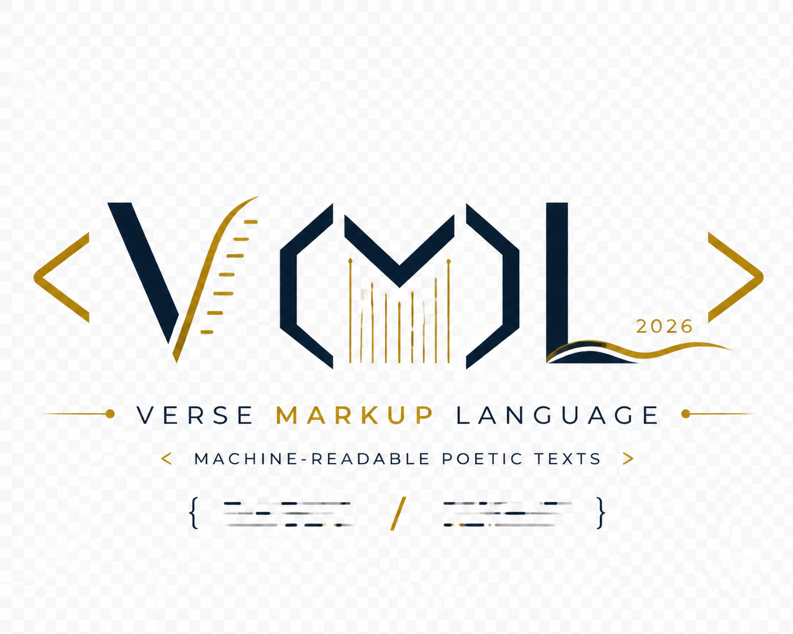

[](https://doi.org/10.5281/zenodo.20100191)  [](https://github.com/nevmenandr/VML/blob/main/LICENSE)


# Verse Markup Language. Спецификация

**VML (Verse Markup Language) 1.0**  
Спецификация языка разметки для машиночитаемого представления стихотворных текстов. Язык спроектирован как минималистичный и дружественный к гуманитариям.

---



## 1. Преамбула

Настоящий документ определяет спецификацию языка разметки VML (Verse Markup Language) — специализированного формата для структурированного, машиночитаемого представления стихотворных произведений. Язык разработан в 2026 году [Борисом Ореховым](https://nevmenandr.github.io/portfolio/) и предназначен для подготовки поэтических текстов к корпусному автоматическому анализу.

### 1.1. Цель создания

Основная цель VML — обеспечить однозначное разграничение функционально различных частей стихотворного текста при его цифровой фиксации. В отличие от универсальных языков разметки (HTML, XML, Markdown) или форматов простого текста, VML фокусируется на специфических элементах поэтического произведения, значимых для формального и квантитативного анализа.

### 1.2 Решаемые задачи

Язык позволяет явно маркировать следующие структурные компоненты стихотворного текста и разграничить их с метаданными:

- имя автора (авторов);
- заглавие (основное и подзаголовки);
- эпиграф (с возможным указанием источника);
- стихотворную строку (строку стиха);
- строфу (группу строк, объединённых ритмико-синтаксическим единством);
- дату написания или датировку;
- нестандартные формы записи стихтворной строки («лесенку»);
- стихотворный цикл (группу стихотворений, объединенных единым замыслом);
- базовые характеристики поэтической метрики.

Такая разметка преобразует неструктурированный или слабоструктурированный поэтический текст в формат, пригодный для автоматического извлечения метаданных, электронного архивного хранения, статистического анализа в области Digital Humanities, а также для тренировки и оценки моделей машинного обучения.

### 1.3. Область применения

VML ориентирован в первую очередь на исследовательские и архивные задачи: создание поэтических корпусов, стиховедческие базы данных, инструменты количественного анализа стиха и автоматической обработки текстов **на любом естественном языке**. Синтаксис языка является универсальным и не привязан к конкретному языку поэзии (русскому, английскому, китайскому и др.), что позволяет использовать VML для разметки стихотворных произведений независимо от их письменности, системы стихосложения или национальной традиции.

Кроме того, VML одинаково применим для разметки произведений, созданных **как человеком, так и искусственным интеллектом**. Это свойство делает язык удобным инструментом для сравнительных исследований человеческой и генеративной поэтики, для аннотирования синтетических корпусов, а также для оценки качества стихотворных текстов, сгенерированных нейросетевыми моделями.

Язык предполагает **простоту освоения для специалистов в области традиционных гуманитарных наук** без специализированной компьютерной подготовки, прежде всего, для филологов-литературоведов. Представление стихотворного текста в соответствии с правилами языка VML может стать способом преодоления непонимания в диалоге между исследователями-гуманитариями и  инженерами, вовлеченными в научный проект, предполагающий цифровой и гуманитарный компоненты.

### 1.4. Лицензия

Спецификация VML 1.0 и эталонные парсеры распространяются под **свободной лицензией** Apache 2.0. Это означает, что любой исследователь, разработчик или организация могут бесплатно использовать, модифицировать и распространять язык и связанные инструменты без ограничений, включая коммерческое использование. Свободная лицензия призвана способствовать широкому внедрению VML в практику научного и образовательного сообщества, а также в проекты по оцифровке и анализу поэтического наследия.

Настоящая спецификация описывает синтаксис, семантику и правила валидации VML версии 1.0. Документ предназначен для разработчиков инструментов обработки поэтических корпусов, исследователей-стиховедов и специалистов по цифровым гуманитарным наукам.

## 2. Основные принципы

- **Строгая иерархическая вложенность** — структура документа VML строится по принципу контейнеров. Область текста, приписанная одному автору (тег `<a>`), содержит все остальные уровни. Внутри этой области могут располагаться стихотворные циклы (`<nn>`), внутри циклов — отдельные стихотворения (начинающиеся с `<&>`), а внутри стихотворения — стихотворные строки, а также (на одном уровне со строками, но не смешиваясь с ними) дата написания (`<#>`) и место написания (`<%>`). Нарушение этой вложенности (например, строка вне стихотворения или дата внутри строки) делает документ невалидным.

- **Минимализм** — синтаксис стремится к ненавязчивости: теги по возможности короткие, а разметка не загромождает поэтический текст, сохраняя его удобочитаемость для человека. Обязательные теги сведены к двум (`<a>`, `<&>`, а также элемент графики естественного языка `\n`), остальные опциональны.

- **Однозначность парсинга** — спецификация определяет строгие правила, позволяющие автоматически восстанавливать структуру произведения без дополнительных эвристик. В частности, действие любого тега ограничено строкой (если иное не оговорено), а границы стихотворения маркируются явно через `<&>`.

- **Несмешиваемость уровней** — служебные элементы (дата, место) не могут находиться внутри стихотворной строки. Они располагаются отдельными строками после строк стихотворения или перед ними, но всегда вне потока строк. Прозаические вставки (`<rm>`) также выделяются в отдельные строки и не перемежаются со стихами внутри одной строки.

## 3. Синтаксис языка

Синтаксис VML (Version 1.0) базируется на двух типах знаков:  
1. **символах письменности естественного языка** (буквы, цифры, знаки препинания, пробелы и пр.) — они образуют содержательный текст произведения;  
2. **специализированных тегах** — они управляют структурой разметки и не входят в сам поэтический текст.

### 3.1. Общая форма тегов

- Тег заключается в **угловые скобки** `<` и `>`.
- Внутри скобок для наиболее частотных, базовых тегов помещается **один символ** (например, `<a>`, `<n>`, `<&>`).
- Для более сложных и редких случаев (эпиграф, цикл, иноязычная вставка и т. п.) число символов в теге может быть **больше одного** (например, `<rm>`, `<nn>`, `<l-rus>`).
- **Закрывающий тег** (если пара тегов предполагает явное закрытие области действия) образуется добавлением **символа слеша `/`** перед содержимым тега: `</nn>`, `</l-rus>` и т. д.
- Наличие пробелов между тегом и тем, что он обозначает, не регламентируется и остается на усмотрение составителя корпуса. Написания `<a>Александр Пушкин` и `<a> Александр Пушкин` равно допустимы.

### 3.2. Обязательные и опциональные элементы

Документ на VML содержит как **обязательные**, так и **опциональные** элементы.

#### Обязательные элементы (без них документ не считается валидным):

1. **Тег автора** – `<a>` (от *author*).  
2. **Тег инципита** – `<&>` (первая стихотворная строка произведения).  
3. **Символ переноса строки** – `\n` (разделитель строк).

#### Опциональные элементы (могут отсутствовать):

- Тег заглавия `<n>` (от *name*) – при его использовании начинается новое стихотворение.
- Теги для эпиграфа `<rm>`, датировки `<#>`, строфической разметки `<*>` и т. п.  
- Тег начала стихотворения до инципита `<&&>`.
- Любые дополнительные атрибуты или аннотации.

Отсутствие опционального элемента допустимо в двух случаях:  
- соответствующий выделению элементом синтаксиса фрагмент отсутствует в исходном тексте (например, у стихотворения нет эпиграфа);  
- исследователь сознательно отказывается от кодирования информации «высокого уровня» (например, разметки метрики или строфики), ограничиваясь только выделением минимальной структуры.

### 3.3. Правило действия тегов

**Каждый тег относится к тексту, который следует за ним до конца текущей строки** (в общем случае до символа `\n`).  

Пример:  
`<a> Александр Пушкин`  
означает, что строка «Александр Пушкин» является значением тега `<a>` — именем автора.  

После такого тега **стихотворный текст не может начинаться на той же строке**. Стихотворный текст должен начинаться со следующей строки (или позже). Это требование обеспечивает чёткое отделение метаданных от поэтического текста.

### 3.4. Семантика основных тегов

Ниже представлен раздел **3.4.1** спецификации VML с добавленными положениями о формате записи имени автора, анонимных текстах и указании нескольких авторов.

---

#### 3.4.1. Тег автора `<a>`

- **Назначение** – указание автора (одного или нескольких) стихотворного произведения или набора произведений, следующих в документе.
- **Область действия**: весь текст от строки с тегом `<a>` **до следующего тега `<a>`** (или до конца документа, если других тегов `<a>` нет).  
  Это позволяет группировать несколько стихотворений одного автора без повторения имени.
- Если встречается новый тег `<a>`, то все последующие тексты (до очередного `<a>`) приписываются уже новому автору.
- **Закрывающий тег `</a>`** не требуется.

Пример:  
```
<a> Анна Ахматова
<&> Сжала руки под темной вуалью...
«Отчего ты сегодня бледна?»

...

<a> Edgar Allan Poe
<n> A Dream
<&> In visions of the dark night
⁠    I have dreamed of joy departed—
…
```
Здесь стихи до следующего `<a>` принадлежат Ахматовой, далее – Эдгару Алану По.

**Формат записи имени автора** не определяется языком VML. Это может быть формат «Имя Фамилия», «Фамилия Имя Отчество», «Имя Фамилия Отчество» или любой другой по выбору исследователя. Рекомендуется применять унифицированное написание всех имён авторов в пределах одного корпуса с использованием тега `<a>`, однако отсутствие унификации не делает документ невалидным.

**Для анонимных текстов** рекомендуется обозначение `Unknown` (или его эквивалент на языке корпуса, например `Аноним`), но никаких специальных обязательных обозначений для неизвестных авторов в языке не предусмотрено.

**Несколько авторов** записываются в одной строке с тегом `<a>` через запятую. Рекомендуется перечислять авторов в алфавитном порядке по фамилии, однако это также остаётся на выбор создателя корпуса и не влияет на валидность.

Пример указания нескольких авторов:
```
<a> Илья Ильф, Валентин Катаев, Юрий Олеша
<&> Шёл я в ночь по улице тёмной,
...
```

Между строкой с тегом `<a>` и последующими строками может быть сколько угодно пробельных строк (в которых есть только пробелы и символ переноса строки).

#### 3.4.2. Тег инципита `<&>`

- **Назначение** – маркировка **первой стихотворной строки** произведения (инципит). Инципит служит якорем для идентификации стихотворения в корпусе.
- **Обязательность**: каждое стихотворение в документе VML **обязано** иметь тег `<&>`.
- **Содержимое**: после `<&>` до конца строки записывается первая строка стихотворения (инципит).  
  – Сам инципит одновременно является и первой стихотворной строкой, поэтому после него должен стоять `\n`, за которым следует вторая строка и т.д.
- **Границы стихотворения**: весь текст между `<&>` данного стихотворения и либо следующим `<&>` (начало нового стихотворения), либо новым `<n>` (заглавие следующего стихотворения), либо новым `<&&>` (явное начало следующего стихотворения до инципита), либо новым `<a>` (смена автора), либо концом документа считается **текстом одного стихотворения**. Если перед строкой с `<&>` есть строка с `<n>` (заглавие), то заглавие относится к этому же стихотворению.
- **Наличие заглавия**: даже если у стихотворения есть заглавие (тег `<n>`), тег `<&>` всё равно обязателен. Весь текст между `<n>` и `<&>` трактуется как заглавие. Он может содержать сколько угодно пробельных строк, но рекомедуется не допускать их больше одной.


Пример (без заглавия):
```
<a> Михаил Лермонтов
<&> И скучно и грустно, и некому руку подать  
В минуту душевной невзгоды...
```

Пример (с заглавием и инципитом):
```
<a> Федор Тютчев
<n> Цицерон
<&> Оратор римский говорил
Средь бурь гражданских и тревоги:
«Я поздно встал — и на дороге
Застигнут ночью Рима был!»
```

#### 3.4.3. Тег заглавия `<n>`

- **Назначение** – указание на заглавие стихотворения (основного и подзаглавия, если оно есть).
- **Опциональность**: тег `<n>` может отсутствовать (у стихотворения нет заглавия).
- **Правила использования**:
  - Заглавие записывается в строке непосредственно после `<n>`.
  - В отличие от большинства тегов, заглавие **может содержать внутренние переносы строк**. Это позволяет оформлять многострочные заголовки или сложные названия с подзаголовками.  
    *Технически* всё, что находится между тегом `<n>` и следующим тегом `<&>`, считается заглавием, даже если включает несколько `\n`.
- **Порядок расположения**: тег `<n>` (если используется) должен предшествовать тегу `<&>` внутри одного стихотворения.
- **Начало нового стихотворения**: тег `<n>` всегда обозначает начало нового стихотворения. Если в документе встречается `<n>` после завершённого стихотворения (или сразу после тега автора), то открывается новое стихотворение, заглавием которого служит текст после `<n>`. Предыдущее стихотворение считается законченным непосредственно перед строкой с `<n>`. Между `<n>` и `<&>` может находиться произвольное количество строк (в том числе пустых), но инципит в итоге должен присутствовать.

Пример:  
```
<a> Александр Блок
<n> Незнакомка
<&> По вечерам над ресторанами  
Горячий воздух дик и глух,  
И правит окриками пьяными  
Весенний и тлетворный дух.
```

#### 3.4.4. Тег начала стихотворения до инципита `<&&>`

- **Назначение** – явное указание границы между стихотворениями в тех случаях, когда у следующего стихотворения перед инципитом (`<&>`) присутствуют прозаические вставки (`<rm>`), и эти вставки не должны быть отнесены к предыдущему стихотворению. Тег `<&&>` обозначает, что с этой позиции начинается новое стихотворение, но его первая стихотворная строка (инципит) будет указана позже (после возможных эпиграфов, посвящений и т.п.).
- **Синтаксис**: тег `<&&>` записывается на отдельной строке. После него до конца строки не должно быть никакого содержательного текста. Обязателен следующий за ним символ `\n`.
- **Область действия**: всё, что идёт после `<&&>` до следующего `<&>` (инципита) включительно, относится к новому стихотворению. Любые прозаические вставки (`<rm>`) или пустые строки, находящиеся между `<&&>` и `<&>`, трактуются как часть этого нового стихотворения.
- **Отношение к предыдущему стихотворению**: предыдущее стихотворение считается законченным непосредственно перед строкой с `<&&>`. Тег `<&&>` не является частью предыдущего стихотворения.
- **Взаимодействие с другими тегами**:
  - `<&&>` **не заменяет** обязательный тег инципита (`<&>`). Инципит всё равно должен присутствовать в каждом стихотворении.
  - Если используется `<&&>`, он **должен предшествовать** тегу `<&>` (и, опционально, `<rm>`) в пределах одного стихотворения.
  - Тег `<&&>` не может находиться внутри стихотворной строки, строфы или иноязычной вставки.
- **Опциональность**: тег `<&&>` используется только при необходимости разрешить неоднозначность границ стихотворений. В простых случаях (когда эпиграф отсутствует или стихотворение имеет заглавие `<n>`) он не требуется.

**Пример (два стихотворения подряд, у второго есть эпиграф):**

```
<a> Алексей Пурин
<nn> Стихи с эпиграфами

...

<&>Что ж, гляди на закаты
да на лунную гладь —
мир прекрасный, куда ты
норовишь? — не сдержать...
Иль закон нам не ведом,
что, не зная стыда,
нас, хоть будь Архимедом,
вытесняет вода?

<&&>
<rm>* * *

<rm>...И общей не уйдёт судьбы.
<rm>                           Державин

<&>А ты, несчастный, но счастливый,
в ответ сквозь слёзы улыбнись:
ручей струится говорливый
с горы, тропа стремится ввысь;
пусть час, но лилия глядится
(ты помнишь!) в девственную гладь —
и шумно вспархивает птица...
Всё знать — и ничего не знать!

...

</nn>
```

Здесь эпиграф, отмеченный `<rm>`, относится ко второму стихотворению, а не к первому, благодаря тегу `<&&>`.


---

### 3.5. Разметка стихотворных строк

**Стихотворные строки не имеют специальных тегов.**  
Строки внутри одного стихотворения отделяются друг от друга **символом переноса строки** `\n`.  

Это минимальный и обязательный уровень разметки:  
- Если документ содержит только `<a>`, `<&>` и последовательность строк, разделённых `\n`, — он уже является валидным (при условии, что все строки стихотворные, а не прозаические вставки).

Пример минимально валидного документа:
```
<a> Неизвестный автор
<&> Первая строка
Вторая строка
Третья строка
```

### 3.6. Опциональная разметка необязательных элементов стихотворного текста (прозаические вставки, дата, место)

Помимо базовых обязательных и тегов, VML предоставляет дополнительные теги для фиксации трёх типов информации, которая может присутствовать в оригинальном стихотворном тексте или быть добавлена исследователем:  
- прозаические (непоэтические) вставки;  
- год написания;  
- место написания.

Эти элементы не влияют на валидность документа, но при их наличии должны быть размечены согласно описанным ниже правилам.

#### 3.6.1. Тег прозаической вставки `<rm>`

- **Назначение** – маркировка любой строки, которая **не является частью стихотворного текста**, но встречается внутри документа со стихами.  
  К таким элементам относятся:
  - эпиграф (прозаический или стихотворный);
  - прозаическое посвящение;
  - прозаическое предисловие или послесловие;
  - имя действующего лица перед репликой в стихотворной пьесе (драме в стихах);
  - любые другие нерифмованные, неметрические вставки, не являющиеся частью основного стихотворного текста.

- **Синтаксис**: тег `<rm>` ставится **в начале непоэтической строки** (перед первым содержательным символом).  
- **Область действия**: всё, что следует за `<rm>` до конца строки (символа `\n`), считается прозаической вставкой и **не рассматривается парсером как часть стихотворного текста** (не участвует в подсчёте строк, не анализируется метрически и т. п.).
- **Многострочные вставки**: если прозаическая вставка занимает несколько строк, **тег `<rm>` должен быть повторен перед каждой строкой** вставки.  
  Не допускается использование одного `<rm>` для охвата нескольких строк.

**Пример (многострочная прозаическая вставка):**
```
<a> Анна Ахматова
<nn>Реквием
<&>Нет, и не под чуждым небосводом,
И не под защитой чуждых крыл, —
Я была тогда с моим народом,
Там, где мой народ, к несчастью, был.
<#>1961

<rm>Вместо предисловия
<rm>В страшные годы ежовщины я провела
<rm>семнадцать месяцев в тюремных очередях
<rm>в Ленинграде. Как-то раз кто-то «опознал» меня.
<rm>Тогда стоящая за мной женщина с голубыми губами,
<rm>которая, конечно, никогда в жизни не слыхала моего
<rm>имени, очнулась от свойственного нам всем
<rm>оцепенения и спросила меня на ухо
<rm>(там все говорили шепотом):
<rm>— А это вы можете описать?
<rm>И я сказала:
<rm>— Могу.
<rm>Тогда что-то вроде улыбки скользнуло по тому,
<rm>что некогда было ее лицом.
<rm>1 апреля 1957
<rm>Ленинград

...

</nn>
```

Тег `<rm>` может использоваться даже если текст эпиграфа стихотворный, но автор разметки хочет явно отделить эпиграф от основного текста, не прибегая к тегу строфы.

В случае, если нестихотворная строка не содержит слов естественного языка, то использование тега `<rm>` не требуется:

```
<a>Михаил Лермонтов
1
<&>Выхожу один я на дорогу;  
Сквозь туман кремнистый путь блестит;  
Ночь тиха. Пустыня внемлет богу,  
И звезда с звездою говорит.
2
В небесах торжественно и чудно!  
Спит земля в сиянье голубом…  
Что же мне так больно и так трудно?  
Жду ль чего? Жалею ли о чем?
...
```

#### 3.6.2. Тег года написания `<#>`

- **Назначение** – указание на год (или годы) создания стихотворения.
- **Синтаксис**: тег `<#>` (решётка) ставится в начале строки, после него (до `\n`) записывается **год(ы) написания** в формате четырёхзначного числа (например, `1829`) или диапазона, содержащего четырехзначные числа `1829–1830`. Трех- и менее значные числа допустимы только для дат ранее начала второго тысячелетия н. э. 
- **Положение в документе**: обычно строка с тегом `<#>` располагается **после строки с инципитом** (`<&>`) и **после всех стихотворных строк**. Точное место не нормировано, но рекомендуется помещать дату сразу после последней строки стихотворения.
- **Отношение к стихотворному тексту**: строка с тегом `<#>` не считается частью поэтического текста и не влияет на нумерацию стихотворных строк.

**Пример:**
```
<a> Фёдор Тютчев
<&> Умом Россию не понять,
Аршином общим не измерить:
У ней особенная стать —
В Россию можно только верить.
<#> 1866
```

#### 3.6.3. Тег места написания `<%>`

- **Назначение** – указание географического места (топонима), где было создано стихотворение.
- **Синтаксис**: тег `<%>` (процент) ставится в начале строки, после него (до `\n`) записывается **место написания** – название города, деревни, усадьбы, страны или иного топонима.
- **Положение в документе**: строка с тегом `<%>` обычно следует **после строки с годом написания** (если год указан), либо после стихотворных строк (если год не указан).

**Пример:**
```
<a> Осип Мандельштам
<&> Сестры тяжесть и нежность, одинаковы ваши приметы.
...
В медленном водовороте тяжёлые нежные розы,  
Розы тяжесть и нежность в двойные венки заплела!
<#> 1920
<%> Петроград
```

#### 3.6.4. Разделение года и места при исходной совместной записи

**Важное правило**: если в оригинальном источнике год и место написания записаны в одной строке (например, «1969, Туапсе»), то **по правилам VML они должны быть разделены и записаны в разных строках** – с отдельными тегами `<#>` и `<%>`.

**Неправильно (одна строка, смешанный тег):**
```
<#> 1969, Туапсе
```

**Правильно:**
```
<#> 1969
<%> Туапсе
```

Это требование обеспечивает машинную однозначность: парсер может извлечь год и место как независимые структурированные поля без необходимости разбирать строку на составные части.

> **Примечание:** Язык VML не предназначен для хранения подробных метаданных. Рекмендуется использовать для них отдельные таблицы.

#### 3.6.5. Порядок следования необязательных элементов

В пределах одного стихотворения (между двумя тегами `<&>` и `<&>` или между `<&>` и концом документа) необязательные элементы могут следовать в любом порядке, однако рекомендована следующая практика:

1. Прозаические вставки (тег `<rm>`) – там, где они встречаются в тексте (например, эпиграф перед стихами, реплики между стихами).
2. Основной стихотворный текст (строки без тегов, разделённые `\n`).
3. Год написания (`<#>`).
4. Место написания (`<%>`).

Если прозаическая вставка находится **внутри** стихотворного текста (например, ремарка в драме), она помещается на отдельной строке с тегом `<rm>`, не нарушая общей последовательности.

---

Все перечисленные теги подчиняются **общему правилу**: текст, к которому они относятся, находится **в той же строке после тега до `\n`**. Исключения (как в случае с многострочным `<n>`) должны быть явно оговорены в спецификации для каждого такого тега.

## 3.7. Опциональная разметка более высокого уровня

Для исследовательских задач, требующих детализации, в VML могут использоваться **дополнительные теги** (в том числе длиной более двух символов). Эти теги не являются обязательными и служат для кодирования информации, выходящей за рамки минимальной структурной разметки (автор, инципит, стихотворные строки). Их применение зависит от целей конкретного корпусного исследования.

Ниже перечислены основные теги высокого уровня, поддерживаемые спецификацией VML 1.0.

### 3.7.1. Тег строфы `<*>`

- **Назначение** – явное указание границ строф в стихотворном тексте.
- **Синтаксис**: тег `<*>` (звёздочка в угловых скобках) ставится **перед первой строкой строфы** (на отдельной строке или непосредственно перед строкой).
- **Закрывающий тег**: не требуется. Конец строфы определяется началом следующей строфы (т. е. появлением следующего тега `<*>`) либо концом стихотворного текста (например, появлением тегов `<rm>`, `<#>` и подобных).
- **Обработка**: строки от одного `<*>` до следующего `<*>` (или до конца стихотворного текста) считаются принадлежащими одной строфе.

**Пример:**
```
<a> Михаил Лермонтов
<*> 1
Выхожу один я на дорогу;
Сквозь туман кремнистый путь блестит;
Ночь тиха. Пустыня внемлет богу,
И звезда с звездою говорит.

<*>
2
В небесах торжественно и чудно!
Спит земля в сиянье голубом…
Что же мне так больно и так трудно?
Жду ль чего? жалею ли о чём?
```

> **Примечание:** если тег `<*>` отсутствует, разметка строфики не производится, и весь стихотворный текст после инципита интерпретируется как единая последовательность строк (без внутренних группировок).

### 3.7.2. Тег цикла стихов `<nn>` и `</nn>`

- **Назначение** – объединение нескольких стихотворений в цикл (например, «Стихи о Прекрасной Даме», «Реквием»).
- **Синтаксис**: парный тег `<nn>` (открывающий) и `</nn>` (закрывающий). Название цикла записывается на той же строке, что и открывающий тег `<nn>`, до символа `\n`.
- **Вложенность**: внутри цикла могут содержаться несколько стихотворений, каждое со своей обязательной разметкой (`<n>`, `<&>` и т.д.).
- **Область действия**: всё, что находится между `<nn> Название цикла` и `</nn>`, считается принадлежащим данному циклу.

**Пример:**

```
<a> Александр Блок

<nn> Стихи о Прекрасной Даме

<n> Вступление
<&> Отдых напрасен. Дорога крута.
Вечер прекрасен. Стучу в ворота.

...

</nn>
```

> **Примечание:** то же решение предлагается для длинных многочастных стихотворных произведений, например, поэм, состоящих из нескольких глав (песен), или стихотворных драм, где каждое действие (или явление) должно трактоваться как самостоятельное стихотворение внутри цикла.

**Пример поэмы**

```
<a> Гомер

<nn> Илиада

<&>Гнев, боги­ня, вос­пой Ахил­ле­са, Пеле­е­ва сына,
Гроз­ный, кото­рый ахе­я­нам тыся­чи бед­ст­вий соде­лал

...

<&>Все, и бес­смерт­ные боги, и кон­но­до­спеш­ные мужи,
Спа­ли всю ночь; но Кро­ни­о­на сла­дост­ный сон не поко­ил.
Он вол­но­вал­ся забот­ны­ми дума­ми, как Ахил­ле­са
Честь ото­мстить и ахе­ян тол­пы истре­бить пред суда­ми.

...

</nn>

```

**Пример стихотворной драмы**

```
<a> Александр Грибоедов
<nn>Горе от ума. Комедия в четырех действиях, в стихах
<rm>Действующие лица:
<rm>Павел Афанасьевич Фамусов, управляющий в казенном месте.
<rm>Софья Павловна, его дочь.
<rm>Лизанька, служанка.
<rm>Алексей Степанович Молчалин, секретарь Фамусова, живущий у него в доме.
<rm>Александр Андреевич Чацкий.

...

<n>Действие первое
<rm>Явление 1
<rm>Гостиная, в ней большие часы, справа дверь в спальню Софии, откудова слышно фортопияно с флейтою, которые потом умолкают. Лизанька среди комнаты спит, свесившись с кресел. Утро, чуть день брезжится.
<rm>Лизанька
<rm>(вдруг просыпается, встает с кресел, оглядывается)
<&>Светает!.. Ах! как скоро ночь минула!
Вчера просилась спать — отказ.
«Ждем друга». — Нужен глаз да глаз,
Не спи, покудова не скатишься со стула.
Теперь вот только что вздремнула,
Уж день!.. сказать им...
<rm>(Стучится к Софии.)
Господа,
Эй! Софья Павловна, беда.
Зашла беседа ваша за́ ночь.
Вы глухи? — Алексей Степаныч!
Сударыня!... — И страх их не берет!
...

<n>Действие второе
<rm>Явление 1
<rm>Фамусов, Слуга.
<&>Петрушка, вечно ты с обновкой,
С разодранным локтем. Достань-ка календарь:
Читай не так, как пономарь;
А с чувством, с толком, с расстановкой.
Постой же. — На листе черкни на записном

...

</nn>

```

### 3.7.3. Тег иноязычных вставок `<l-ISO>`

- **Назначение** – маркировка фрагментов стихотворного текста, написанных на другом языке (иноязычные вставки, цитаты, двуязычные стихи).
- **Синтаксис**: парный тег `<l-ISO>` ... `</l-ISO>`, где компонент `ISO` заменяется на **трёхбуквенный код языка** по стандарту **ISO 639-2 или ISO 639-3** (например, `rus` для русского, `eng` для английского, `fra` для французского, `deu` для немецкого, `lat` для латыни).
- **Действие**: всё содержимое между открывающим и закрывающим тегом считается текстом на указанном языке. Теги могут располагаться внутри одной стихотворной строки или охватывать несколько строк (однако закрывающий тег обязательно должен присутствовать).

**Примеры:**
```
<*>
Служив отлично благородно,
Долгами жил его отец,
Давал три бала ежегодно
И промотался наконец.
Судьба Евгения хранила:
Сперва <l-fra>Madame</l-fra> за ним ходила,
Потом Monsieur ее сменил.
Ребенок был резов, но мил.
Monsieur <l-fra>l'Abbé</l-fra>, француз убогой,
Чтоб не измучилось дитя,
Учил его всему шутя,
Не докучал моралью строгой,
Слегка за шалости бранил
И в Летний сад гулять водил.

```

> **Примечание:** для текста на основном языке текста тег не используется. Тег `<l-ISO>` предназначен только для отклонений от основного языка произведения. Обозначение основного языка не регламентируется языком и остается на усмотрение исследователя

### 3.7.4. Тег метрической характеристики строки `<m-VALUE>`

- **Назначение** – явное указание стихотворного размера (метра) для каждой строки. Этот тег позволяет зафиксировать результаты автоматического или ручного стиховедческого анализа.
- **Синтаксис**: тег `<m-VALUE>` ставится **в начале стихотворной строки** (перед её текстом). Для инципита (<&>) тег `<m-VALUE>` ставится **после тега `<&>`** (перед текстом строки). Значение `VALUE` кодирует метрическую информацию в зависимости от системы стихосложения.

#### 3.7.4.1. Силлабическое стихосложение (S)

Формат: `<m-Sчисло>` – где `число` обозначает количество слогов в строке.

Пример (`<m-S12>` – 12-сложник):
```
<&> <m-S12> Не ветер, вея с высоты,
<m-S12> Листов коснулся в ночь луны;
```

#### 3.7.4.2. Силлабо-тоническое стихосложение (R)

Формат: `<m-R[метр][число_стоп][клаузула]>`

- **Метр** (одна буква):  
  `Я` – ямб, `Х` – хорей, `Д` – дактиль, `Аф` – амфибрахий, `Ан` – анапест.
- **Число стоп** – арабская цифра (2, 3, 4, 5, 6...).
- **Клаузула** (один символ):  
  `м` – мужская (ударение на последнем слоге),  
  `ж` – женская (ударение на предпоследнем),  
  `д` – дактилическая (ударение на третьем от конца),  
  `г` – гипердактилическая.

Пример (`<m-RЯ4м>` – четырёхстопный ямб с мужской клаузулой):
```
<m-RЯ4ж> Мой дядя самых честных правил,
<m-RЯ4м> Когда не в шутку занемог...
```

#### 3.7.4.3. Тоническое стихосложение (A)

Формат: `<m-A*[число_безударных]*[число_безударных]*...>` – где звёздочкой `*` обозначается ударный слог, а числом между звёздами – количество безударных слогов между ударными. 

Пример `<m-A*2*2*1>` означает: ударный, 2 безударных, ударный, 2 безударных, ударный, 1 безударный. 

Более понятный пример: для строки «Мой дядя самых честных правил» (ударения: Мой, дя́дя, са́мых, че́стных, пра́вил) – если рассматривать ее чисто тонически – ритм можно записать как схему интервалов: `1*1*1*1*1`

**Пример:**
```
<&> <m-A*2*4*1> Шёл я по улице незнакомой
<m-A1*1*4*> И вдруг услышал вороний грай,
```

> **Рекомендация:** приоритетно использовать силлабо-тоническую разметку для русского классического стиха, а тоническую – для акцентного стиха и случаев, когда метр неочевиден.

#### 3.7.4.4. Силлабо-метрическое стихосложение (M)

Формат: `<m-M*[число_немаркированных_слогов]*[число_немаркированных_слогов]*...>` – где звёздочкой `*` обозначается маркированный слог (например, долгий), а числом между звёздами – количество немаркированных слогов (например, кратких) между маркированными. 

> **Примечание:** 

Язык VML не предназначен для системной нюансированной метрической характеристики текстов и вводит названные в этом разделе обозначения только как компромиссное решение для тех составителей корпусов, которые нуждаются в такой разметке в рамках своих задач, но при этом стремятся использовать VML как решение для построения своего корпуса. В прочих случаях следует воспользоваться альтернативным решением для описания метрики.

### 3.7.5. Тег «лесенки» (ступенчатая запись) `<l-NUM>`

- **Назначение** – разметка визуального расположения строк по принципу «лесенки» (как у Владимира Маяковского), где каждая часть строки сдвигается вправо на определённую «ступень».
- **Контекст**: используется в тех случаях, когда стихотворная строка разбита на фрагменты, каждый из которых выравнивается с отступом, что влияет на ритмическое восприятие.
- **Синтаксис**: тег `<l-NUM>` ставится **перед фрагментом строки**, который должен быть выровнен на соответствующую ступень (отступ). `NUM` – **положительное целое число** (1, 2, 3...), обозначающее номер ступени (глубину вложенности).  Тег `<l-1>` не нужен, он совпадает с началом строки.
- **Область действия** – от тега до следующего `<l-NUM>`. Каждая часть начинается с тега `<l-NUM>`, который отделяет одну «ступеньку» от другой. Вся последовательность частей графически образует одну стихотворную строку.

**Пример** (из Маяковского):
```
А сам наутро, <l-2> чтоб не разориться, 
прогуленное <l-2> с рабочих <l-3> выжмет сторицей.
```

*Интерпретация:* Тег <l-2>` обозначает отступ второй ступени, `<l-3>` – третьей и т. д. Каждая «ступенька» включена в единую строку и при анализе эти фрагменты могут склеиваться или обрабатываться как одна метрическая единица или как отдельные сегменты строки.

> **Ограничение:** `NUM` может быть только положительным целым числом (1, 2, 3...). Значение 0 не допускается.

**Дополнительный пример (в сочетании с инципитом):**

```
<a> Владимир Маяковский
<n>Стихи о советском паспорте
<&>Я волком бы <l-2> выгрыз <l-3> бюрократизм.
К мандатам <l-2>почтения нету.
К любым <l-2> чертям с матерями <l-3>катись
любая бумажка. <l-2> Но эту…
 
 
```

> **Примечание:** тег `<l-NUM>` не отменяет базовой разметки стихотворных строк. Каждая строка с тегом `<l-NUM>` (и последующим текстом) по-прежнему считается отдельной строкой в рамках общей нумерации.

### 3.7.6. Общие замечания по опциональной разметке

- Все теги, описанные в данном разделе, **не являются обязательными**. Документ VML считается валидным, даже если ни один из них не используется (при условии соблюдения обязательных элементов из раздела 3.2).
- Различные теги высокоуровневой разметки могут **комбинироваться** в рамках одного стихотворения. Например, строка может одновременно иметь метку метра `<m-A*2*1*1>` и быть частью лесенки `<l-2>`. В таких случаях порядок следования тегов в начале строки рекомендуется: сначала `<m-...>`, затем `<l-...>`, затем текст строки. Для инципита: `<&>` `<m-...>` `<l-...>` текст.
- Теги высокоуровневой разметки **не вкладываются друг в друга без необходимости**. Например, не следует помещать тег цикла `<nn>` внутрь тега строфы `<*>` – это нарушает иерархическую вложенность.
- Для ранних версий VML (1.0) не поддерживаются произвольные пользовательские теги; все дополнительные теги должны соответствовать перечисленным в спецификации. Расширения возможны через атрибуты или будущие версии языка.

Этот раздел определяет синтаксис и семантику опциональной разметки высокого уровня в VML 1.0. Исследователи могут использовать подмножество этих тегов в зависимости от задач формирования корпуса.

---

### 3.8. Экранирование служебных последовательностей

В VML **экранирование требуется только в тех случаях, когда последовательность символов в содержательной части текста может быть ошибочно интерпретирована как тег языка**. Обычные угловые скобки `<` и `>`, встречающиеся по отдельности (например, в математических выражениях или сравнениях), экранирования не требуют и не влияют на разметку.

#### 3.8.1. Какие последовательности подлежат экранированию

Экранированию подлежат **фрагменты текста, точно совпадающие с синтаксисом валидного тега VML**, включая:
- базовые одно- и двухсимвольные теги: `<a>`, `<n>`, `<&>`, `<rm>`, `<nn>`;
- многосимвольные теги:  `<l-rus>` и любые другие, определённые в спецификации или расширениях;
- закрывающие теги: `</rm>`, `</nn>`, `</l-rus>` и т.п.

Если такая последовательность встречается внутри текста стихотворения, заглавия, эпиграфа или другого элемента **не как тег, а как часть естественно-языкового содержания**, она должна быть экранирована.

#### 3.8.2. Символ экранирования

В качестве escape-символа используется **обратный слеш** `\`.

Правило экранирования: перед открывающей угловой скобкой `<` (или перед последовательностью `</` для закрывающих тегов) ставится `\`.  
Весь тег после этого рассматривается парсером как обычный текст, а не как элемент разметки.

#### 3.8.3. Таблица экранирования

| Исходная последовательность (текст) | Экранированная запись |
|-------------------------------------|------------------------|
| `<a>`                               | `\<a>`                |
| `<n>`                               | `\<n>`                |
| `<&>`                               | `\<&>`                |
| `<#>`                              | `\<#>`               |
| `</rm>`                              | `\</rm>`               |
| `</nn>`                              | `\</nn>`               |
| `<&&>`                             | `\<&&>`                |
| сам символ `\` (если он должен быть передан буквально) | `\\`    |

#### 3.8.4. Примеры

**Пример 1 (ложное срабатывание тега)**
```
<&> Он сказал: \<a> это не тег\</a>, а просто текст.
```
Здесь последовательности `<a>` и `</a>` экранированы, поэтому они не интерпретируются как тег автора, а выводятся как часть строки.

**Пример 2 (отсутствие экранирования угловых скобок по отдельности)**
```
<&> 2 < 3 и 5 > 4 — верные неравенства.
```
Угловые скобки не экранируются, так как `2 < 3` не образует ни одного валидного тега VML. Разметка остаётся корректной.

**Пример 3 (экранирование escape-символа)**
```
<&> Путь к файлу: C:\\Users\\poet\\
```
Каждый обратный слеш удваивается, чтобы не быть съеденным при разборе.

#### 3.8.5. Замечания

- Экранирование применяется **только к полным тегам**, а не к отдельным символам `<` или `>`.
- Если внутри текста встречается незакрытая угловая скобка (например, `<` без последующего имени тега и `>`), она не требует экранирования.
- Парсер VML должен интерпретировать любую последовательность вида `\<...>` как обычный текст, независимо от того, является ли `...` валидным именем тега или нет. Это обеспечивает устойчивость к ошибкам и упрощает ручное кодирование.


## 3.9. Пробельные символы и отступы

В языке VML **отсутствуют специальные теги** для обозначения отступов в начале стихотворной строки или пробельных интервалов внутри строки. Пробельные символы (пробел ` `, табуляция `\t`, а также другие пробельные символы Unicode по усмотрению реализации) могут присутствовать в тексте строки и сохраняются парсером как часть строкового содержимого. Однако они **не учитываются** при разборе структуры документа (иерархии авторов, стихотворений, строк).

### 3.9.1. Рекомендации по использованию

- **Для отступов в начале строки** (например, для визуального выделения строки внутри строфы или для имитации типографского рисунка подлинника) **рекомендуется использовать символ табуляции** `\t`. Это обеспечивает единообразие в разных корпусах и позволяет легко отделить форматирующие отступы от значимых пробелов.
- **Для внутренних пробелов** между частями строки (например, при визуальном выделении цезуры) рекомендуется использовать символ табуляции `\t`. 

### 3.9.2. Формальное определение

1. Перед первым непробельным символом строки (после любого тега, если тег присутствует) могут находиться ноль или более символов табуляции `\t` и/или пробелов ` `. Все они считаются **форматирующими пробелами** и должны игнорироваться при сравнении текста строки на содержательном уровне, если иное не оговорено исследователем.

2. Символы табуляции и пробелы **никак не влияют** на действие обязательных тегов (`<a>`, `<&>`, `<n>`) и опциональных тегов (строфы, лесенки и т.д.). В частности, при наличии тега `<l-NUM>` (лесенка) любые отступы, созданные с помощью пробелов или табуляции в начале строки, **полностью игнорируются**: визуальная ступень определяется исключительно значением `NUM` в теге `<l-NUM>`.

### 3.9.3. Примеры

**Пример 1 – отступ табуляцией в начале строки:**
```
<&> \tВот иду я по тропинке,
\t\tА навстречу мне — весна.
```
Парсер сохранит символы табуляции, но они будут считаться частью содержимого строки. Для чистого сравнения строк исследователь может нормализовать текст, удалив начальные табуляции.

**Пример 2 – конфликт с лесенкой (неправильное использование):**
```
<l-2> \t\tА это отступ не имеет значения
```
Поскольку присутствует тег `<l-2>`, начальные табуляции игнорируются; реальная ступень определяется числом `2`.

#### 3.9.4. Обоснование

Отсутствие специальных тегов для пробелов и отступов соответствует принципу **минимализма** VML. Табуляция выбрана в качестве предпочтительного средства для начальных отступов, так как она:
- однозначно отличается от пробелов (особенно при нефиксированной ширине);
- легко удаляется или преобразуется при постобработке;
- широко поддерживается текстовыми редакторами и инструментами обработки корпусов.

#### 3.10. Лингвистическая разметка, комментарии и пропуски

В языке VML **отсутствуют специальные теги** для обозначения пропусков, комментариев и для лингвистической разметки текста. Допускаются любые обозначения на усмотрение создателя корпуса, если они не конфликтуют с синтаксисом языка VML. Не рекомендуется помещать комментарии в тело документа, их следует вынести в отдельный файл, чтобы они не смешивались со стихотворными строками, подлежащими подсчетам и анализу.

---

Настоящее описание синтаксиса составляет главу 3 спецификации VML 1.0. Все примеры и правила являются нормативными.

## 4. Модель данных

Модель данных VML описывает логическую структуру документа, определяя допустимые типы сущностей, их свойства, иерархические связи и правила композиции. Модель не зависит от синтаксического представления (теги, отступы) и служит основой для валидации, преобразования и аннотирования поэтических корпусов.

### 4.1. Корневой элемент

Корнем любого VML-документа является неявный контейнер, который может содержать один или несколько **авторских блоков** (элемент `<a>`). Документ не имеет отдельного корневого тега. Допустимо наличие только одного авторского блока, а также нескольких, разделённых тегами `<a>`. Пробельные строки между блоками игнорируются.

### 4.2. Типы элементов

Все элементы VML делятся на **контейнеры** (могут содержать другие элементы) и **листья** (содержат только текст).

#### 4.2.1. Авторский блок (`author`)

- **Контейнер**. Обозначается тегом `<a>`. Содержит текст (имя автора) как строковое значение и последовательность вложенных элементов:  
  - `cycle` (цикл, `<nn>`) – необязательно
  - `poem` (стихотворение, начинающееся с `<&>` или `<n>`)  
  - `prose` (прозаическая вставка на уровне между стихами, `<rm>`) – необязательно.  
- **Свойства**:  
  - `name` – строковое представление имени автора (может быть в любом формате).   
- **Ограничения**:  
  - Область действия авторского блока продолжается до следующего `<a>` или до конца документа.  
  - Внутри блока нельзя смешивать циклы и стихотворения без явного разделения (циклы имеют приоритет).  
  - После авторского блока не может быть текста вне элемента.

#### 4.2.2. Цикл (`cycle`)

- **Контейнер**. Обозначается парными тегами `<nn> ... </nn>`. Имеет название, записанное как текст после открывающего тега.  
- **Содержит**: один или несколько элементов `poem` (стихотворений). Может также содержать `prose` (эпиграфы, ремарки, другие вставки).  
- **Свойства**:  
  - `title` – название цикла (строка).  
- **Ограничения**:  
  - Циклы не могут быть вложены друг в друга.  
  - Стихотворения внутри цикла могут иметь свои заголовки (`<n>`) и инципиты (`<&>`).  
  - Цикл может занимать весь авторский блок или его часть.

#### 4.2.3. Стихотворение (`poem`)

- **Контейнер**. Начинается обязательно с элемента `incipit` (`<&>`) **или** с необязательного `title` (`<n>`), **или** с `start` (`<&&>`). Если стихотворение начинается с `<n>` (заглавие), то заглавие принадлежит этому стихотворению, а инципит должен следовать позже. 
- **Содержит** (в любом порядке, но с ограничениями на смешивание):  
  - необязательный `title` (заглавие)  
  - ноль или более `stanza` (строф)  
  - одну или более `line` (стихотворных строк, если строфы не выделены)  
  - ноль или более `prose` (прозаических вставок, обычно перед стихами или между строфами)  
  - ноль или один `date` (год)  
  - ноль или один `place` (место)  
- **Свойства**:  
  - `incipit` – первая строка стихотворения (обязательный строковый атрибут).  
  - `title` – строка, может содержать переносы строк (многострочный).  
  - `metrical_default` – опциональная метрика, применяемая ко всем строкам по умолчанию (см. `meter`).  
- **Ограничения**:  
  - Каждое стихотворение должно содержать хотя бы одну строку (после `<&>`).  
  - Элементы `date` и `place` не могут находиться внутри строки или строфы.  
  - Прозаические вставки (`prose`) не могут находиться внутри строки.

#### 4.2.4. Заглавие (`title`)

- **Лист**. Обозначается тегом `<n>`. Содержит текстовую строку (может быть многострочной).  
- **Свойства**:  
  - `value` – текст заглавия.  
- **Ограничения**:  
  - Может отсутствовать.  
  - Должен предшествовать инципиту в пределах стихотворения.

#### 4.2.5. Инципит (`incipit`)

- **Специальный маркер**. Не является самостоятельным элементом, а служит обязательной меткой начала стихотворного текста и одновременно первой строкой.  
- **Свойства**:  
  - `text` – первая строка стихотворения.  
- **Ограничения**:  
  - Ровно один на стихотворение.  
  - После инципита может следовать вторая строка без тега.

#### 4.2.5.1. Маркер начала стихотворения (`start`)

- **Лист**. Обозначается тегом `<&&>`. Не содержит текста (только пустая строка). Используется для явного разделения стихотворений, когда перед инципитом следующего стихотворения есть прозаические вставки.
- **Свойства**: отсутствуют.
- **Ограничения**:
  - Может присутствовать только перед элементами `prose` или `incipit` в пределах одного стихотворения.
  - Не может быть более одного на стихотворение.
  - В одном документе может встречаться многократно.

#### 4.2.6. Стихотворная строка (`line`)

- **Лист**. В VML не имеет явного тега, моделируется как строка текста, ограниченная `\n` и не начинающаяся с тега, кроме случаев, когда строка начинается с метрического тега или тега инципита.  
- **Содержит**: текст строки, возможно, с вложенными элементами `foreign` (иноязычные вставки), `ladder` (лесенка).  
- **Свойства**:  
  - `text` – строка текста.  
  - `meter` – опциональный объект метрики (см. `meter`).  
  - `ladder_step` – номер ступени (для лесенки), если применимо.  
- **Ограничения**:  
  - Не может содержать другие строки.  
  - Не может содержать дату, место, прозаическую вставку.

#### 4.2.7. Строфа (`stanza`)

- **Контейнер**. Обозначается тегом `<*>` (открывающим). Не имеет закрывающего тега.  
- **Содержит**: последовательность `line` (строк).  
- **Свойства**:  
  - `index` – номер строфы в стихотворении (вычисляемый).  
- **Ограничения**:  
  - Если используется разметка строф, все строки стихотворения должны быть распределены по строфам (не может быть строк вне строф).  
  - Строфы не могут быть вложены друг в друга.

#### 4.2.8. Прозаическая вставка (`prose`)

- **Лист**. Обозначается тегом `<rm>`. Содержит текст, не являющийся стихом. Каждая строка вставки требует отдельного тега `<rm>`.  
- **Свойства**:  
  - `text` – строка прозаического текста.  
- **Ограничения**:  
  - Не может содержать стихотворных строк или других элементов.  
  - Многострочная проза кодируется как последовательность элементов `prose`.

#### 4.2.9. Год написания (`date`)

- **Лист**. Обозначается тегом `<#>`.  
- **Содержит**: строку, представляющую год или диапазон (например, `1829`, `1829–1830`).  
- **Свойства**:  
  - `value` – каноническая строка года.  
  - `start`, `end` – числовые значения (опционально, для машинной обработки).  
- **Ограничения**:  
  - Только один на стихотворение.

#### 4.2.10. Место написания (`place`)

- **Лист**. Обозначается тегом `<%>`.  
- **Содержит**: топоним (название места).  
- **Свойства**:  
  - `name` – строковое название.  
- **Ограничения**:  
  - Только один на стихотворение.

#### 4.2.11. Иноязычная вставка (`foreign`)

- **Лист, но может быть вложен в строку**. Обозначается парным тегом `<l-ISO> ... </l-ISO>`.  
- **Содержит**: текст на языке ISO.  
- **Свойства**:  
  - `lang` – трёхбуквенный код языка (ISO 639-2/3).  
  - `text` – фрагмент текста.  
- **Ограничения**:  
  - Не может пересекаться с другими тегами. Должен быть корректно вложен.

#### 4.2.12. Метрическая аннотация (`meter`)

- **Не самостоятельный элемент, а атрибут строки**. Обозначается тегом `<m-VALUE>`, который привязывается к конкретной строке.  
- **Свойства**:  
  - `system` – тип системы стихосложения: `S` (силлабическое), `R` (силлабо-тоническое), `A` (тоническое), `M` (силлабо-метрическое).  
  - `value` – специфичное для системы значение (например, `S12`, `RЯ4м`, `A*2*2*1`).  
- **Ограничения**:  
  - Может быть указан для любой строки, включая инципит (после `<&>`).  
  - Для строк без тега метр не определён.

#### 4.2.13. Лесенка (`ladder`)

- **Специальная разметка внутри строки**. Обозначается тегом `<l-NUM>`, где `NUM` – положительное целое число. Тег указывает на сдвиг начала фрагмента строки.  
- **Свойства**:  
  - `step` – номер ступени (1,2,3...).  
  - `fragment` – текст фрагмента.  
- **Ограничения**:  
  - Применяется только внутри элемента `line`.  
  - `<l-1>` не требуется, подразумевается по умолчанию.

### 4.3. Иерархическая структура (граф наследования)

Ниже приведена схема допустимых вложений (стрелка означает «содержит»):

```
document
  └── author (один или много)
        ├── prose* (опционально)
        ├── cycle*
        │     ├── prose*
        │     └── poem+
        └── poem+ (если нет циклов)
               ├── start?   (опционально)
               ├── title?   (заглавие)
               ├── prose*   (эпиграфы, посвящения и т.п.)
               ├── incipit  (обязательно)
               ├── ( stanza* | line* )
               ├── prose*
               ├── date?
               └── place?
```

Внутри `line` может быть:
- обычный текст
- `foreign` (0+)
- `ladder` фрагменты (0+), но лесенка заменяет обычную последовательность строки на сегментированную.

Внутри `stanza`:
- `line` (1+)
- `prose`? (теоретически возможно, но не рекомендовано)

### 4.4. Атрибуты и метаданные

VML 1.0 не определяет синтаксис для атрибутов тегов (как в XML). Вся метаинформация, связанная с произведением, должна быть вынесена либо в отдельные таблицы (реляционное дополнение), либо закодирована с помощью специальных тегов-листьев (`<#>`, `<%>`, `<l-...>`, `<m-...>`). Для расширенных метаданных рекомендуется использовать параллельные файлы в формате JSON или CSV, ссылаясь на идентификаторы произведений (например, на инципит).

### 4.5. Правила валидации (кратко)

Документ VML считается **валидным**, если:

1. Содержит хотя бы один `<a>` и хотя бы один `<&>` после него.
2. Последовательность вложенности соответствует иерархии из п. 4.3.
3. Каждый `<&>` имеет хотя бы одну последующую строку (стихотворную или прозаическую, но проза не заменяет стих).
4. Все открытые парные теги (`<nn>`, `<l-ISO>`) корректно закрыты.
5. Отсутствуют неэкранированные теги внутри текста (кроме тех случаев, где они допустимы согласно синтаксису).
6. Значения тегов `<l-NUM>` – целые положительные числа.
7. Значения тегов `<m-VALUE>` соответствуют одному из допустимых форматов.
8. Даты (`<#>`) содержат хотя бы одну цифру.
9. Внутри строки нет элементов `date` или `place`.
10. Если в документе встречается тег `<&&>`, то после него (до следующего `<&>`) не может быть стихотворных строк без инципита (т.е. нельзя начать стихотворение только с `<&&>` и строк стихов без `<&>`).
11. Если встречается тег `<n>` после того, как в текущем стихотворении уже был инципит (`<&>`), это трактуется как начало нового стихотворения. Предыдущее стихотворение считается закрытым непосредственно перед строкой с `<n>`.

### 4.6. Пример модели в виде JSON Schema (фрагмент)

Для иллюстрации модель может быть выражена в формате JSON Schema:

```json
{
  "$schema": "http://json-schema.org/draft-07/schema#",
  "type": "array",
  "items": {
    "type": "object",
    "properties": {
      "author": { "type": "string" },
      "cycles": {
        "type": "array",
        "items": {
          "type": "object",
          "properties": {
            "title": { "type": "string" },
            "poems": { "type": "array" }
          }
        }
      },
      "poems": {
        "type": "array",
        "items": {
          "type": "object",
          "properties": {
            "title": { "type": "string" },
            "incipit": { "type": "string" },
            "lines": { "type": "array", "items": { "type": "string" } },
            "stanzas": { "type": "array" },
            "date": { "type": "string" },
            "place": { "type": "string" }
          },
          "required": ["incipit"]
        }
      }
    },
    "required": ["author"]
  }
}
```

### 4.7. Расширяемость

Модель данных VML 1.0 является закрытой: все допустимые типы элементов перечислены выше. В будущих версиях (2.0) возможно введение пользовательских атрибутов через специальный синтаксис, но в текущей спецификации такие расширения не поддерживаются. Для хранения дополнительных метаданных (жанр, тематика, источник публикации) рекомендуется использовать внешние таблицы, связанные с документом через идентификатор (например, путь к файлу + инципит).

## 5. Примеры разметки

### 5.1. Простое стихотворение

```
<a>Константин Симонов
<&>Жди меня, и я вернусь.
Только очень жди,
Жди, когда наводят грусть
Желтые дожди,
Жди, когда снега метут,
Жди, когда жара,
Жди, когда других не ждут,
Позабыв вчера.
Жди, когда из дальних мест
Писем не придет,
Жди, когда уж надоест
Всем, кто вместе ждет.
Жди меня, и я вернусь,
Не желай добра
Всем, кто знает наизусть,
Что забыть пора.
Пусть поверят сын и мать
В то, что нет меня,
Пусть друзья устанут ждать,
Сядут у огня,
Выпьют горькое вино
На помин души…
Жди. И с ними заодно
Выпить не спеши.
Жди меня, и я вернусь,
Всем смертям назло.
Кто не ждал меня, тот пусть
Скажет: — Повезло.
Не понять, не ждавшим им,
Как среди огня
Ожиданием своим
Ты спасла меня.
Как я выжил, будем знать
Только мы с тобой, —
Просто ты умела ждать,
Как никто другой.
<#>1941
```

### 5.2. Многострофное стихотворение с эпиграфом

```
<a>Алексей Пурин

<rm>Ты пробуждаешься, о Байя, из гробницы…
<rm>Батюшков

 
<&>Ты пробуждаешься, о Байя, — Бог
с тобою, Байя!
Не всякий бог восстать из гроба смог —
и Байя не любая.
<*>
Тайфун, землетрясение, волкан
(Неаполя, к примеру) —
а ничего! Лишь пасмурный сафьян,
дурманящий триеру.
<*>
Иль это яхта русских богачей?..
Пусть Бог не выдал,
но не смущает взор уже ничей
твой утлый идол.
<*>
И честные патриции, увы,
не понаедут к маю
из Рима, не сносивши головы,
в целительную Байю…
<*>
Дремотное баюканье олив,
благоуханье рая…
Но Время, и богов испепелив,
течет, играя.
<*>
Субстанции властительнее нет,
неумолимей, неу-
ловимей! Твоему, поэт,
Оно сродни напеву.

```

### 5.3. Многострофное стихотворение на другом языке

```
<a> Самат Ғабидуллин

<n> Халҡым
<&>Уралымды көмөш эйәр итеп,
Ауыҙлыҡлай ваҡыт-толпарын,
Елеп үткән халҡым ҡылысынан
Уйнап ҡалған йәшен уттары.

<*>
Урауҙарҙан ураулығы менән
Айырылып торған юлдары.
Тик түҙемдән түҙемлеге менән
Айырылып торған улдары.

<*>
Урал тормошонан ҡото осоп,
Олаҡҡанда һанһыҙ замандар,
Бер аҙым да ситкә тайшанмайса,
Тороп ҡалған улар Уралда.

<*>
Урал менән халҡым шуға бөгөн
Ер йөҙөндә берҙәй һөйкөмлө:
Урал ғорур, минең халҡым кеүек,
Халҡым ғорур, Урал шикелле!
<#> 1962
```

### 5.4. Примеры в отдельных файлах

Репозиторий языка содержит примеры файлов стихов с разметкой с помощью языка VML:

* [Есенин](Examples/esenin.txt)
* [Карим](Examples/karim.txt)

### 5.5. Примеры программного кода

Репозиторий языка содержит примеры программ, обрабатывающих файлы с разметкой с помощью языка VML:

* [Подсчет авторов, стихотворений, строк](Code/vml_counter.py)

## 6. Формат файла и кодировка

### 6.1. Рекомендуемое расширение

Для файлов, содержащих разметку VML, **рекомендуется использовать расширение `.txt`**.  
Этот выбор продиктован соображениями доступности и универсальности:

- Файлы с расширением `.txt` открываются любым текстовым редактором по умолчанию, что избавляет неопытных пользователей (филологов, архивистов, студентов) от необходимости искать специализированные инструменты или настраивать ассоциации файлов.
- Расширение `.txt` не вызывает ложных ожиданий относительно форматирования (в отличие от `.docx` или `.rtf`) и однозначно сигнализирует о том, что файл содержит простой текст.
- Допустимо использование других расширений (например, `.vml`, `.verse`), но **только для опытных пользователей**, понимающих, как настроить обработку таких файлов в своём инструментарии.

### 6.2. Кодировка символов

**Обязательная кодировка: UTF-8 без BOM (Byte Order Mark).**

- Все VML-файлы должны быть сохранены в кодировке UTF-8.
- **BOM (U+FEFF) не допускается.** Наличие BOM может привести к ошибкам парсинга, особенно в средах, где он обрабатывается как часть содержимого (например, в начале первой строки).
- Использование других кодировок (CP1251, KOI8-R, ISO-8859-1 и т.п.) **не разрешается**. Если исходный текст стихотворения поставляется в иной кодировке, он должен быть перекодирован в UTF-8 до или в процессе разметки.

### 6.3. Нормализация символов перевода строки

**Обязательная нормализация: только LF (`\n`, U+000A).**

- Все символы перевода строки в VML-файле должны быть представлены одним байтом `0x0A` (Line Feed, `\n`).
- **Запрещается использовать**:
  - CRLF (`\r\n`) – последовательность, принятая в Windows;
  - CR (`\r`) – устаревший формат Mac Classic;
  - любые другие Unicode-символы, обозначающие конец строки (например, U+2028 LINE SEPARATOR).
- Нормализация выполняется на этапе подготовки файла. Парсер VML может отвергнуть файл с недопустимыми символами перевода строки или выдать предупреждение (рекомендуется строгий режим).

### 6.4. MIME-тип (для веб-публикации)

При передаче VML-файлов по сети (HTTP, электронная почта, API) следует использовать MIME-тип:

```
text/vml
```

Если поддержка `text/vml` отсутствует, допускается использование `text/plain`. Однако для корректной идентификации типа контента рекомендуется регистрировать `text/vml` в соответствующих сервисах.

### 6.5. Именование файлов

- Имя файла **должно быть осмысленным** и отражать содержимое, особенно если в одном каталоге находятся несколько VML-файлов. Например: `pushkin_anchar.txt`, `akhmatova_requiem.txt`.
- Разрешены латинские буквы, цифры, дефис и подчёркивание. Кириллические буквы и пробелы в именах файлов **не рекомендуются** во избежание проблем с кодировками в некоторых операционных системах и системах контроля версий.
- Регистр символов в имени файла не нормируется, но для переносимости рекомендуется использовать строчные буквы.

### 6.6. Структура файла (поведенческие рекомендации)

- Один VML-файл может содержать одно или несколько стихотворений (или их циклов). Рекомендуется помещать в один файл тексты одного автора или тематически связанные стихотворения.
- Файл **не должен содержать никакого текста вне разметки VML** (например, комментариев редактора в свободной форме). Для комментариев к корпусу следует завести отдельный сопроводительный файл (README, metadata.json и т.п.).
- Пустые строки в начале файла игнорируются. Однако для удобства чтения допускается начинать файл непосредственно с тега `<a>`.

### 6.7. Пример корректного начала файла

```
<a> Анна Ахматова
<&> Сжала руки под темной вуалью…
```

Файл сохранён как `ahmatova_szhala_ruki.txt` в кодировке UTF-8 без BOM, с переводами строк в формате LF.

### 6.8. Рекомендации для текстовых редакторов

- **Notepad++**: «Кодировки» → «Преобразовать в UTF-8 без BOM»; «Правка» → «Формат конца строки (EOL)» → «Unix (LF)».
- **Visual Studio Code**: в правом нижнем углу выбрать «UTF-8» и «LF».
- **Sublime Text**: «File» → «Save with Encoding» → «UTF-8»; «View» → «Line Endings» → «Unix».
- **Встроенный блокнот Windows** (Notepad) не рекомендуется: он по умолчанию добавляет BOM и использует CRLF.

Данный раздел является нормативным для всех файлов, которые позиционируются как валидные VML-документы версии 1.0. Соблюдение этих требований обязательно для обеспечения совместимости между разными парсерами и операционными средами.

## 7. Валидация

Репозиторий содежит [код на языке Python](Code/vml_validator.py) для валидации документа, размеченного в соответствии с синтаксисом VML. Запуск валидатора:

```
python3 vml_validator.py poem.txt
```

## Примечания

- Валидатор **не проверяет**:
  - метрические теги `<m-...>` на внутреннюю согласованность (например, что число стоп разумно);
  - числовые значения `<l-...>` на корректность ступеней (кроме формата);
  - что `<&>` действительно является первым тегом стихотворения (может быть после пустых строк или `<n>`);
  - что внутри заголовка нет недопустимых тегов;
  - что стихотворная строка не содержит запрещённых символов (допускается всё, кроме управляющих).
- Для проверки экранирования используется простой поиск: символ `\` перед `<` игнорируется.
- Валидатор предполагает, что файл сохранён в UTF-8 без BOM. BOM обрабатывается через `utf-8-sig`, но выводится предупреждение.


## 8. Неофициальное (жаргонное) название языка

В профессиональной среде разработчиков, исследователей и инженеров, работающих с корпусной разметкой, нередко формируются неформальные, сокращённые или игровые обозначения для используемых инструментов и языков. Такие жаргонизмы облегчают устную коммуникацию, снижают порог вхождения в рабочий процесс и придают сообществу узнаваемый колорит.

Для языка VML предлагается и рекомендуется к использованию следующее неофициальное название:

### **Веймелка** (произносится: *вей-мел-ка*)

#### Происхождение

Название образовано от фамилии **Кароля Веймелки** (чеш. *Karol Vejmelka*) — чешского хоккейного вратаря, выступавшего в сезоне 2026 года за клуб НХЛ «Юта Маммот» (*Utah Mammoth*). Выбор связан с рядом ассоциаций:

- Фонетическая близость к аббревиатуре **VML** при прочтении на русский лад: «Вэ-Эм-Эл» → «Веймелка».
- Удачная параллель с функциями языка: вратарь «защищает ворота» от неструктурированного текста, порождаемого командой противника, а VML «отражает» смысловые удары, выделяя границы стихотворных элементов.
- Неформальный, тёплый оттенок жаргонизма способствует позитивному восприятию языка среди студентов, аспирантов и разработчиков в гуманитарной сфере.

#### Примеры использования в речи

- *«Я размеченный корпус в веймелку перегнал»* — значит, преобразовал сырые стихи в формат VML.
- *«Веймелка не понимает вложенных циклов?»* — вопрос о поддержке тегов `<nn>`.
- *«Напиши парсер для веймелки на Python»* — создание инструмента для чтения VML.

#### Статус

Название *«Веймелка»* не является нормативным и не заменяет официальную аббревиатуру VML. Оно может использоваться в неформальной переписке, устных докладах, рабочих чатах и учебных материалах без каких-либо ограничений. Автор спецификации ([Борис Орехов](https://nevmenandr.github.io/portfolio/), 2026) относится к данному наименованию с доброжелательным юмором и не возражает против его распространения.

#### Альтернативные варианты

Сообщество вольнo предлагать и другие жаргонные варианты (например, *«вэмэлка»*, *«версочка»*, *«стишачок»*), однако именно *«Веймелка»* закрепляется в настоящей спецификации как **рекомендуемое** неофициальное наименование, одобренное автором.

## Приложение. Полная грамматика VML 1.0 в расширенной форме Бэкуса — Наура (EBNF)

Ниже представлена нормативная грамматика языка VML, записанная в расширенной форме Бэкуса — Наура (EBNF) согласно стандарту ISO/IEC 14977. Грамматика описывает корректные документы VML 1.0 без учёта семантических ограничений (например, уникальности инципита или обязательного наличия строк после `<&>`), которые вынесены в раздел валидации.

### Соглашения о нотации

- Каждый нетерминал записан в `верблюжьейНотации` с заглавной буквы.
- Терминалы в кавычках: `"<a>"`, `"\n"`.
- `(* ... *)` – комментарий в EBNF.
- `? любой символ ?` – расшифровка в тексте.
- `{ ... }` – повторение ноль или более раз.
- `[ ... ]` – необязательный элемент.
- `( ... )` – группировка.
- `|` – альтернатива.
- `-` – исключение (например, `символ - "\n"`).

### Общая структура документа

```
Document         = { AuthorBlock | EmptyLine } ;
EmptyLine        = ? строка, содержащая только пробелы и/или табуляции ? , "\n" ;
AuthorBlock      = AuthorTag , { ( PoemBlock | CycleBlock | ProseLine | EmptyLine ) } ;
AuthorTag        = "<a>" , [ AuthorName ] , "\n" ;
AuthorName       = ? строка до конца строки, не содержащая управляющих символов ? ;
```

### Цикл стихов

```

CycleBlock       = CycleOpen , { ( PoemBlock | ProseLine | EmptyLine ) } , CycleClose ;
CycleOpen        = "<nn>" , [ CycleTitle ] , "\n" ;
CycleTitle       = ? строка до конца строки ? ;
CycleClose       = "</nn>" , "\n" ;
```

### Стихотворение

```
PoemBlock        = StartMarker? , TitleBlock? , IncipitLine , { StructuralElement } , [ DatePlaceBlock ] ;
StartMarker      = "<&&>" , "\n" ;
TitleBlock       = "<n>" , TitleText , "\n" ;
TitleText        = ? многострочный текст до следующего тега `<&>` (может содержать внутренние `\n`) ? ;
IncipitLine      = "<&>" , [ MeterTag ] , [ LadderTagSequence ] , LineContent , "\n" ;
StructuralElement = ( StanzaBlock | VerseLine | ProseLine | EmptyLine ) ;
VerseLine        = [ MeterTag ] , [ LadderTagSequence ] , LineContent , "\n" ;
LineContent      = { ( TextFragment | ForeignBlock | EscapedSequence | "\\" ) } ;
TextFragment     = ? последовательность любых символов, кроме `<`, `>`, `\`, `&`, `\n`? , но с учётом исключений для тегов ? ; (* упрощённо: любой текст, не начинающий тег *)
```

### Строфа

```
StanzaBlock      = StanzaTag , { ( VerseLine | ProseLine | EmptyLine) } ;
StanzaTag        = "<*>" , [ "\n" ] ; (* может быть на отдельной строке или перед строкой *)
```

### Прозаическая вставка

```
ProseLine        = "<rm>" , ProseText , "\n" ;
ProseText        = ? строка текста (не может содержать символ `\n`) ? ;
```

### Дата и место

```
DatePlaceBlock   = ( DateLine | PlaceLine ) , [ ( DateLine | PlaceLine ) ] ; (* максимум по одному каждого *)
DateLine         = "<#>" , DateValue , "\n" ;
DateValue        = ? год, диапазон годов (например, "1829" или "1829–1830") ? ;
PlaceLine        = "<%>" , PlaceValue , "\n" ;
PlaceValue       = ? топоним (строка) ? ;
```

### Иноязычная вставка

```
ForeignBlock     = "<l-" , LangCode , ">" , ForeignContent , "</l-" , LangCode , ">" ;
LangCode         = ? трёхбуквенный код ISO 639-2 или ISO 639-3 ? ;
ForeignContent   = { TextFragment | EscapedSequence | "\\" } ;
```

### Метрическая аннотация

```
MeterTag         = "<m-" , MeterValue , ">" ;
MeterValue       = ( "S" , UnsignedInteger )                     (* силлабика *)
                 | ( "R" , MeterType , UnsignedInteger , Clausula ) (* силлабо-тоника *)
                 | ( "A" , AccentPattern )                       (* тоника *)
                 | ( "M" , Pattern ) ;                           (* силлабо-метрика *)
MeterType        = "Я" | "Х" | "Д" | "Аф" | "Ан" ;
Clausula         = "м" | "ж" | "д" | "г" ;
AccentPattern    = "*" , { UnsignedInteger , "*" } , [ UnsignedInteger ] ;
Pattern          = "*" , { UnsignedInteger , "*" } , [ UnsignedInteger ] ;
UnsignedInteger  = ? цифра 0-9, повторённая один или более раз ? , но для числа стоп – цифра 2-6? в спецификации ограничений нет, кроме положительности ;
```

### Лесенка

```
LadderTagSequence = LadderTag , { LadderTag } ;
LadderTag        = "<l-" , PositiveInteger , ">" ;
PositiveInteger  = ? цифра 1-9, затем цифры 0-9 ? ;
```

### Экранирование

```
EscapedSequence  = "\\" , ( 
                       "a" | "n" | "&" | "#" | "rm" | "nn" | "/" | "\\" 
                     | "<" | ">" | "*" | "%" | "l-" | "m-" | "?" любой другой символ ? ) ;
(* Экранируется либо весь тег целиком (например, "\<a>"), либо отдельный служебный символ.
   По правилам спецификации, экранирование применяется перед открывающей угловой скобкой тега.
   В упрощённой форме любая последовательность "\<...>" считается экранированным текстом. *)
```

### Комментарии и пробелы

Пробельные символы (пробел ` `, табуляция `\t`) в начале строки (после тега или перед текстом) **не влияют на структуру** и включаются в `LineContent` как обычные символы. Пустые строки (только пробелы и `\n`) эквивалентны `EmptyLine` и игнорируются.

### Исключения и дополнительные правила

1. После `<a>` и до конца строки не может находиться стихотворный текст (только имя автора).  
2. После `<&>` обязательно должна следовать хотя бы одна строка (непосредственно инципит, а затем другие строки).  
3. Внутри `TitleText` могут встречаться любые символы, включая `\n`, но интерпретация продолжается до тега `<&>` или до `<a>` (смена автора).  
4. Все парные теги (`<nn>`, `</nn>`, `<l-ISO>`, `</l-ISO>`) должны быть правильно вложены.  
5. Тег `<&>` не может встречаться внутри `ForeignBlock` или внутри `TitleText`.  
6. Теги `<#>`, `<%>`, `<rm>` не могут быть частью `LineContent` – они всегда начинают новую строку.  
7. Символы `<`, `>`, `&`, `\` должны быть экранированы, если они образуют валидный тег VML. Отдельные угловые скобки экранирования не требуют.

### Пример корректного документа согласно EBNF

```ebnf
Document = 
   "<a>", "Анна Ахматова", "\n",
   "<nn>", "Реквием", "\n",
   "<&>", "Нет, и не под чуждым небосводом,", "\n",
   "И не под защитой чуждых крыл, —", "\n",
   "Я была тогда с моим народом,", "\n",
   "Там, где мой народ, к несчастью, был.", "\n",
   "<#>", "1961", "\n",
   "<rm>", "Вместо предисловия", "\n",
   "<rm>", "В страшные годы ежовщины...", "\n",
   "</nn>", "\n"
```

### Примечание

Приведённая грамматика является **нормативным** описанием синтаксиса VML 1.0. Реализации парсеров должны строго следовать ей, за исключением возможных расширений (версия 1.1 и выше), которые будут оформлены отдельным дополнением. В спорных случаях приоритет имеет текст спецификации разделов 1–3 над EBNF-записью.

## Цитирование

Если язык оказался полезен для вашей работы, пожалуйста, сошлитесь на него в своей публикации:

`Orekhov, B. Verse Markup Language. 1.0, Zenodo, 9 May 2026, https://doi.org/10.5281/zenodo.20100192.`


```
@software{orekhov_2026_20100192,
  author       = {Orekhov, Boris},
  title        = {Verse Markup Language},
  month        = may,
  year         = 2026,
  publisher    = {Zenodo},
  version      = {1.0},
  doi          = {10.5281/zenodo.20100192},
  url          = {https://doi.org/10.5281/zenodo.20100192},
}
```


